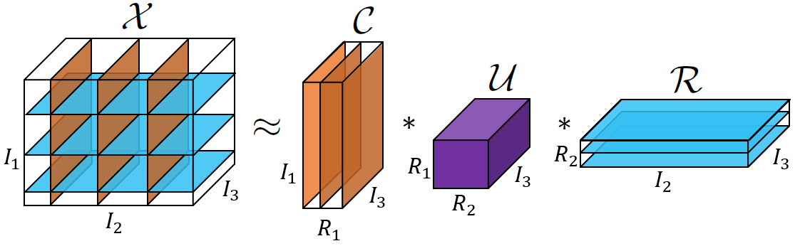

# Adaptive Randomized Pivoting for Tensor Singular Value Decomposition Model

## Overview

T-ARP provides efficient algorithms for common-index tensor cross-approximation of "any"-order tensors (3rd and above). It is a generalization of the ARP algorithm ("Adaptive randomized pivoting for column subset selection, DEIM, and low-rank approximation" by Alice Cortinovis and Daniel Kressner) for the T-SVD model. An illustration of common-index tensor cross-approximation is shown below.



This repository contains the source code for T-ARP, and the experiments to reproduce the results in the paper, "Adaptive Randomized Pivoting for Tensor Singular Value Decomposition Model" by Ahmadsho Akdodshoev, Valentin Leplat and Salman Ahmadi-Asl. https://arxiv.org/abs/2606.26688.

## installation

Step 1: Download python

Step 2: Create a virtual environment

Step 3: Download the repository using git:

```bash
git clone --single-branch --branch main https://github.com/ah-haqqdod/T-ARP.git
```

Step 4: Install the library using pip:

```bash
pip install -e src/
```

The installation will also install the required dependencies; python >3.11 is recommended.

### Project structure

The project structure is as follows:

```
src/
├── t_arp/                          # Core library package
│   ├── tubal/                      # Tubal (tensor) algebra module
│   │   ├── t_matrix.py             # Tubal matrix definitions
│   │   ├── t_arp.py                # Tubal ARP algorithm
│   │   ├── t_css_baselines.py      # Tubal CSS baseline methods
│   │   └── utils.py
│   ├── matrix/                     # Matrix algebra module
│   │   ├── arp.py                  # ARP column subset selection
│   │   ├── css.py                  # CSS algorithm
│   │   ├── utils.py
│   │   └── css_modules/            # Pluggable CSS methods
│   │       ├── abc.py              # Abstract base class
│   │       ├── arp.py
│   │       ├── leverage_scores.py
│   │       └── uniform.py
│   └── benchmark/                  # Benchmarking utilities
│       ├── kodak_benchmark.py
│       ├── metrics/                # Image quality metrics
│       │   ├── error.py
│       │   ├── psnr.py
│       │   ├── ssim.py
│       │   └── utils.py
│       └── utils/                  # I/O helpers
│           ├── kodak.py
│           ├── metrics_io.py
│           └── yuv.py
├── benchmarks/                     # Standalone benchmark scripts
│   ├── kodak/
│   │   ├── config.yaml
│   │   └── standalone_benchmark.py
│   ├── synth/
│   │   ├── config.yaml
│   │   └── standalone_benchmark.py
│   ├── yuv/
│   │   ├── config.yaml
│   │   └── standalone_benchmark.py
│   ├── aggregate_tables.py
│   ├── plot_benchmark.py
│   └── plot_statistics.py
└── test/                           # Test suite
    ├── matrix/
    │   └── arp/
    │       ├── test_arp_DNA.py
    │       └── test_arp_synth.py
    ├── tubal/
    │   ├── test_t_householder.py
    │   ├── test_t_mult.py
    │   ├── test_t_prod.py
    │   ├── tsvd.py
    │   └── tsvd_yuv.py
    └── benchmark/
        ├── test_benchmark_tubal.py
        └── test_metrax_vs_manual.py
```

## Numeric evaluations

The numeric evaluations and empirical results are presented in the `experiments` branch, under `src/benchmarks`.

The instruction for how to run the experiments is provided in `src/benchmarks/readme.md`.

## T-Matrix structure

The T-Matrix module (`src/t_arp/tubal/t_matrix.py`) is used to define the interface for working with tensor structures subject to `t-product`. The name `T-Matrix` stands for `Tubal Matrix`, which has a matrix-like structure, but each element is an array, e.g., a vector representing RGB values of a pixel.

The usage of the `TMatrix` structure, the `T-ARP` algorithms, and other methods are demonstrated in the `src/t_arp/` directory.

---

## 📄 Citation

If you use ARP-T-CUR or T-ARP algorithms in your research, please cite our paper:

```bibtex
@misc{akdodshoev2026adaptiverandomizedpivotingtensor,
      title={Adaptive Randomized Pivoting for Tensor Singular Value Decomposition Model}, 
      author={Ahmadsho Akdodshoev and Valentin Leplat and Salman Ahmadi-Asl},
      year={2026},
      eprint={2606.26688},
      archivePrefix={arXiv},
      primaryClass={math.NA},
      url={https://arxiv.org/abs/2606.26688}, 
}
```

## 📄 License

This project is licensed under the **MIT License** (see `LICENSE`).

**Key points (MIT):**

- ✅ **Use**: you can use this software for any purpose
- ✅ **Modify & distribute**: you can modify, distribute, and sublicense it
- ✅ **Commercial use**: permitted
- ✅ **Attribution**: include the copyright and license notice in copies
- ✅ **No warranty**: the software is provided "as is"

## 📧 Support and Contact

For questions, bug reports, or contributions, please contact:
**ahmad dot akdod [at] gmail dot com**
