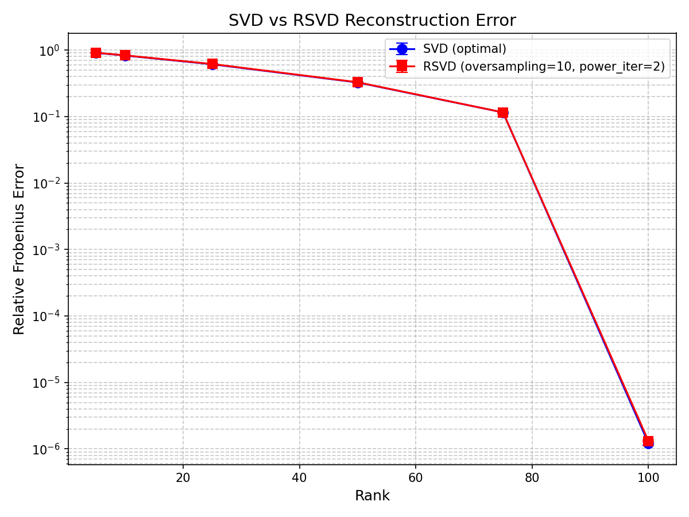
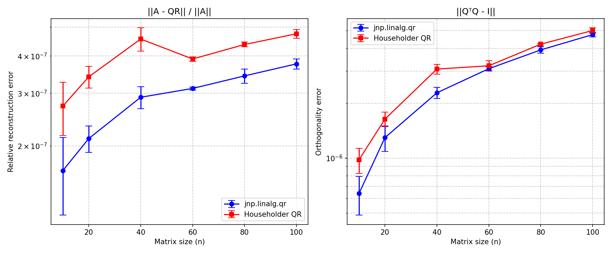
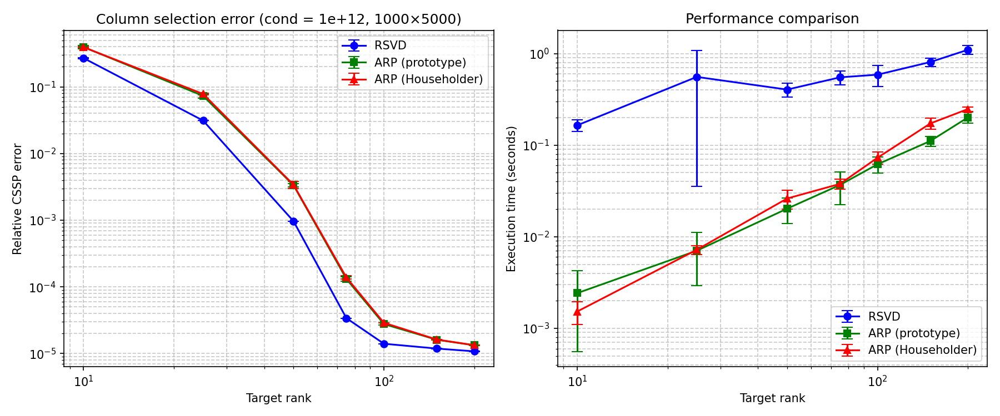
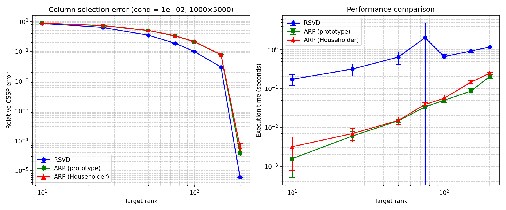

# Tests

## Matrix Methods

### Test rSVD

Run the test

```
python src/test/matrix/test_rsvd.py
```


- Relative error of SVD vs rSVD on a random Gaussian matrix $\mathbf A \in \mathbb R^{100\times 100}$.

### Test Householder reflection (QR decomposition)

Run the test

```
python src/test/matrix/test_householder.py
```


- Built-in implementation of QR decomposition VS QR decomposition based on an implementation of Householder Reflection used in ARP and t-ARP.
- Tested on random gaussian square matrices of size $n$.

### Test ARP

**DNA dataset** sourced from official ARP repository https://github.com/Alice94/ARP/blob/main/data/DNA_matrix.txt

Run the test

```
python src/test/matrix/arp/test_arp_DNA.py
```


- 10 samples are used. Both ARP methods are run using identical random keys
- RSVD uses default parameters
- It is observed that ARP Householder results with slightly higher error

**Synthetic test** on random matrices with known true rank and some perturbation.

Run the test

```
python src/test/matrix/arp/test_arp_synth.py
```



- 5 samples are used. Both ARP methods are run using identical random keys
- RSVD uses default parameters
## Tucker Methods

### Test TTM and HOSVD

Run test

```
python src/test/tensor/test_ttm.py
```


Results
```
TTM direct test: relative error = 0.00e+00
SELF HOSVD(rank=6, eps=None, use_error=False)
HOSVD error in function 0.0
HOSVD reconstruction error (via ttm): 6.26e-07
All TTM tests passed.
```
- The results show that for a random gaussian tensor of shape (4, 5, 6) the Tensor-times-matrix product is implemented correctly using `tensordot` function
- It also shows that HOSVD decomposition works
- An issue is identified with the module. Only a single rank can be passed that is used to contract all dimensions.

### Demo ARP-HOSVD

The KODAK dataset is available inside this repository. To run the demonstration execute 

```
python src/test/tensor/hosvd_kodak.py
```

It will run three tensor decompositions

- HOSVD
- ARP-HOSVD on float32 typed images
- ARP-HOSVD on uint8 typed images

## Tubal Methods

### Test tubal algebra

**t-product**. Tests associativity, distributivity and identity

```
python src/test/tubal/test_t_prod.py
```

**t-multiplication** (experimental). The following tests commutativity, associativity and identity properties of the t-multiplication implementation

```
python src/test/tubal/test_t_mult.py
```

Many values approach zero (approximately `1e-8`) but do not become zero.

### Test tubal Householder

This test will be reimplemented.

### Demo tubal ARP

This demonstration requires the YUV dataset which is not attached in the repository. Run the demo by executing

```
python src/test/tubal/tsvd_yuv.py
```
